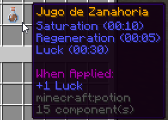

# Jugo de Zanahoria

<figure><figcaption></figcaption></figure>

### Receta (Brewing Stand)

Necesitas usar una botella de agua y añadirle una zanahoria dorada.

<figure><figcaption></figcaption></figure>
